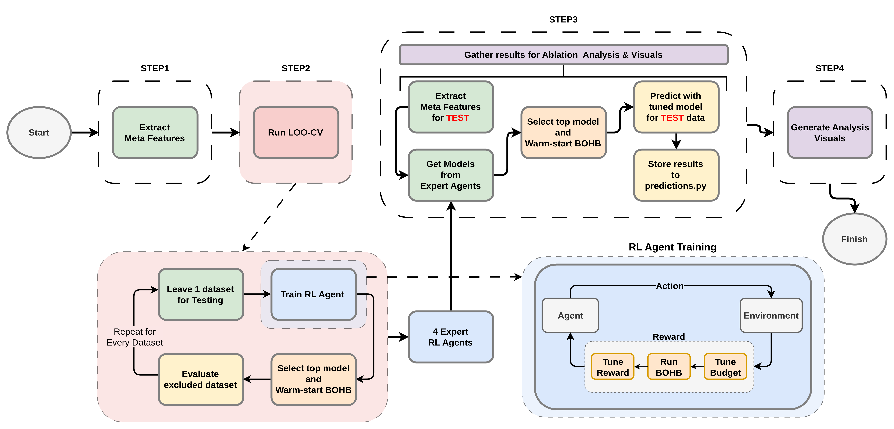
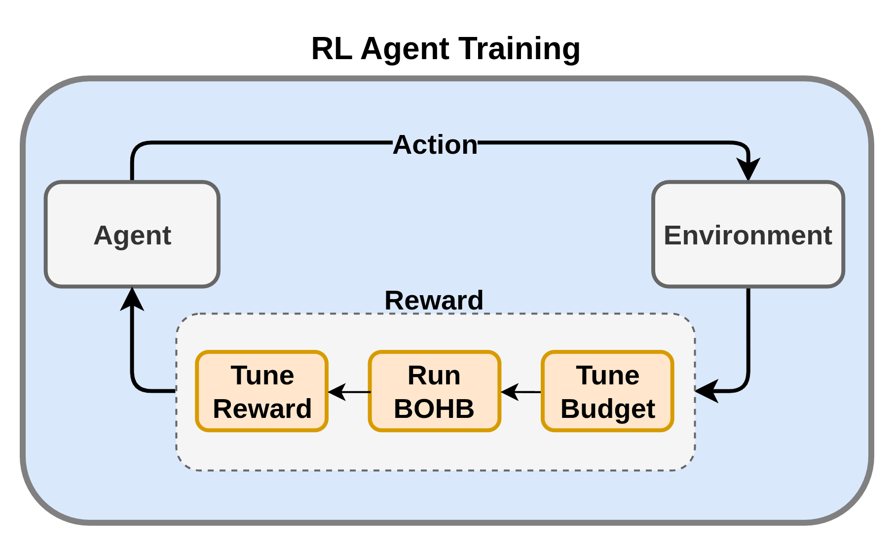
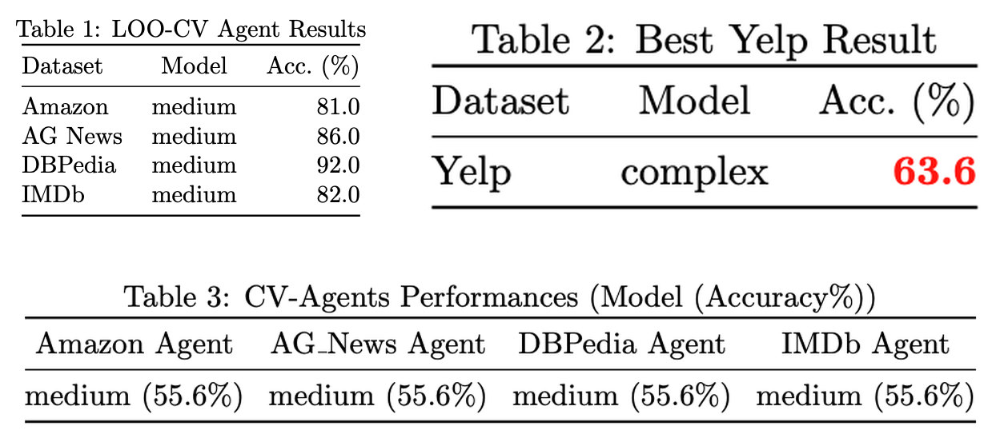
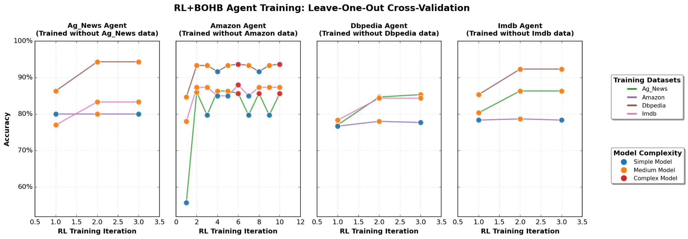
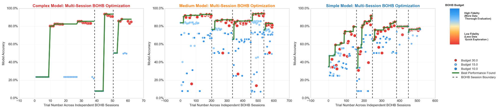
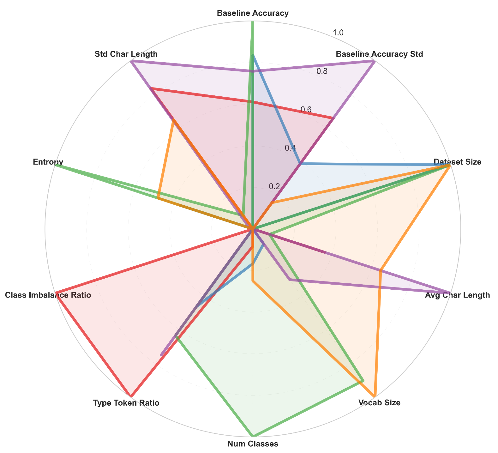

# ExpertRL-HPO

### Meta-feature-aware RL with budget-smart BOHB for lightweight AutoML

**ExpertRL-HPO** is a one-click **AutoML** pipeline for **Natural Language Processing (NLP)** text classification. An **RL agent** reads a dataset's **meta-features** and picks the model complexity, then multi-fidelity **BOHB** tunes that model on a tight budget. So, the agent decides what to train, BOHB figures out how to train it well without burning compute.

> The full poster is available at [ExpertRL-HPO Poster](assets/ExpertRL-HPO-poster.pdf) for the one-page version.

Built for the SS25 AutoML course at the University of Freiburg by **Berke Ceylan, Uralp Ergin, and İsmail Karabaş**.

<p align="center">
  
</p>

## Motivation

**RL-based Dynamic Algorithm Configuration (DAC)** can adapt model complexity per dataset, but training the agent normally costs thousands of expensive evaluations. **BOHB** cuts search cost by testing many configs on small data slices, but it assumes the pipeline is already fixed. For text-classification challenges with heterogeneous datasets and tight budgets, neither one is enough on its own.

So we put them in a **single loop**. The RL agent narrows things down to one model family, and BOHB does the heavy lifting inside it with Hyperband-style budget allocation: many configs evaluated cheaply, a few promoted to full evaluation. Each tier gets its own search space, and the accuracy BOHB measures flows back into the agent's reward.

## Architecture

We frame model selection as a **Markov Decision Process**: one decision per episode, just "given this dataset, which tier should I train?"

<p align="center">
  
</p>

- **State (s):** a normalized meta-feature vector (37 features, defined in `automl/constants.py`).
- **Action (a):** pick a model tier.
  - `simple`: TF-IDF + Logistic Regression / SVM
  - `medium`: TF-IDF + Truncated SVD (LSA) + Logistic Regression
  - `complex`: TF-IDF + Multi-layer Perceptron
- **Transition:** the state stays fixed after the action, so it's really a contextual bandit framed as an MDP.
- **Reward:**

  ```
  reward = 0.5 * accuracy
         - 0.2 * complexity_penalty
         + 0.15 * confidence_gap
         + 0.15 * feature_richness
  ```

  Accuracy comes from BOHB, the penalty discourages over-engineering, the confidence gap pushes toward heavier models when the baseline is weak and noisy, and richness rewards vocabulary diversity. The agent is a **Deep Q-Network (DQN)**.

The pipeline runs in four steps:

1. **Extract meta-features** from every dataset (text statistics, complexity measures, a quick baseline accuracy).
2. **Run leave-one-out CV.** Hold out one dataset, train the RL+BOHB loop on the other three, evaluate on the held-out one. This gives **four expert agents**, each tuned to different dataset characteristics.
3. **Apply to a new dataset.** Extract its meta-features, ask each agent for a model, warm-start BOHB from the best one, tune, and store predictions.
4. **Generate analysis visuals** for the run (examples are in Results).

## Results

We trained on Amazon, AG News, DBPedia, and IMDb, and treated Yelp as the unseen exam dataset.


<p align="center">
  
</p>

- **Table 1** is the leave-one-out result: each agent evaluated on the dataset it never saw. Accuracy runs from 81% (Amazon) up to 92% (DBPedia), and the agent keeps landing on the *medium* tier.
- **Table 2** is the headline on the held-out Yelp set: **63.6%** with a complex model warm-started from the experts.
- **Table 3** shows all four CV agents agreeing on medium, which means the meta-feature signal is stable across datasets.

### Expert agents learning over time

<p align="center">
  
</p>

Four agents, each trained with one dataset left out. Accuracy climbs and settles as RL training iterations progress. Amazon is the noisiest (hardest to generalize to), while DBPedia and IMDb stabilize fast.

### Budget-smart search in action

<p align="center">
  
</p>

BOHB spends most trials on cheap, low-fidelity evaluations (warm/red points) and only promotes promising configs to expensive high-fidelity runs (cool/blue points). The green line is the best accuracy so far. The complex model jumps in big steps, the simple one climbs steadily, and both plateau without wasting budget.

### How meta-features guide the agent

<p align="center">
  
</p>

Each dataset has its own fingerprint across baseline accuracy, size, vocab size, class imbalance, entropy, and more. That's the signal the agent reads. Easy-looking datasets (high baseline, low imbalance) get a lighter model; messier ones push it toward medium or complex.

> The full poster is at [`assets/ExpertRL-HPO-poster.pdf`](assets/ExpertRL-HPO-poster.pdf) for the one-page version.

## Project layout

```
ExpertRL-HPO/
├── run.py                      # Entry point: parses args, runs the pipeline
├── pipeline.py                 # Orchestrates the 4 steps end to end
├── setup_data.py               # Downloads and organizes the datasets
├── automl/
│   ├── constants.py            # Feature order, model tiers, seeds
│   ├── meta_features.py        # Dataset fingerprint extraction
│   ├── rl_agent.py             # DQN environment + RLModelSelector
│   ├── bohb_optimization.py    # SMAC3 / Hyperband multi-fidelity search
│   ├── models.py               # Simple / Medium / Complex model classes
│   ├── visualizer.py           # All the analysis plots
│   └── logging_utils.py        # Structured run logging
└── assets/                     # Diagrams, result plots, and the poster
```

## Getting started

### 1. Create the environment

**Conda (recommended)**

```bash
conda create -n automl-env python=3.10
conda activate automl-env
```

**or venv**

```bash
python3 -m venv automl-env
source automl-env/bin/activate        # Linux / Mac
# automl-env\Scripts\activate         # Windows
```

### 2. Install

```bash
pip install -e .
```

Verify it worked:

```bash
python -c "import automl; print('AutoML package installed successfully')"
```

### 3. Get the data

The easy path downloads both the training datasets and the exam dataset:

```bash
python setup_data.py
```

This pulls Phase 1 (amazon, ag_news, dbpedia, imdb) and Phase 2 (yelp), extracts everything, and verifies the structure:

```
data/
├── yelp/            # Phase 2 (exam dataset)
│   ├── train.csv
│   └── test.csv
├── amazon/          # Phase 1 (training datasets)
│   ├── train.csv
│   └── test.csv
├── ag_news/
├── dbpedia/
└── imdb/
```

If the script fails, grab the archives manually and extract them into `data/` with the same layout:

1. Phase 1: [text-phase1.zip](https://ml.informatik.uni-freiburg.de/research-artifacts/automl-exam-25-text/text-phase1.zip)
2. Phase 2: [text-phase2.zip](https://ml.informatik.uni-freiburg.de/research-artifacts/automl-exam-25-text/text-phase2.zip)

## Running the pipeline

A full run (with a 24 hour ceiling):

```bash
python run.py --time 24.0 --output final_submission --max_iterations 10
```

### Command line arguments

| Argument | Default | Description |
|----------|---------|-------------|
| `--time` | 1.0 | Maximum runtime in hours (float) |
| `--output` | test_run | Experiment name (saved under `experiments/`) |
| `--max_iterations` | 10 | Maximum RL training iterations |
| `--random_state` | 42 | Random seed for reproducibility |

### Output folder structure

| Path | What it is |
|------|------------|
| `data/exam_dataset/predictions.npy` | Test predictions for auto-evaluation |
| `experiments/<name>/run_*/final_results.pkl` | Complete pipeline results |
| `experiments/<name>/run_*/logs/` | Detailed execution logs |
| `experiments/<name>/run_*/visualizations/` | The analysis plots |
| `experiments/<name>/run_*/models/` | Trained RL agents |

## Limitations and what's next

- **No heavy transformers.** Backbones like BERT or RoBERTa were left out due to hardware limits, so the tiers stay lightweight.
- **Narrow training scope.** The agents saw four datasets; more data would likely improve generalization.

With more time we'd broaden the benchmarks to SOTA architectures (BERT, RoBERTa, Longformer), feed BOHB-measured accuracy even more directly into the reward, and weight meta-features by how much they actually drive the agent's decisions.


Licensed under MIT (see [`LICENSE`](LICENSE)).
